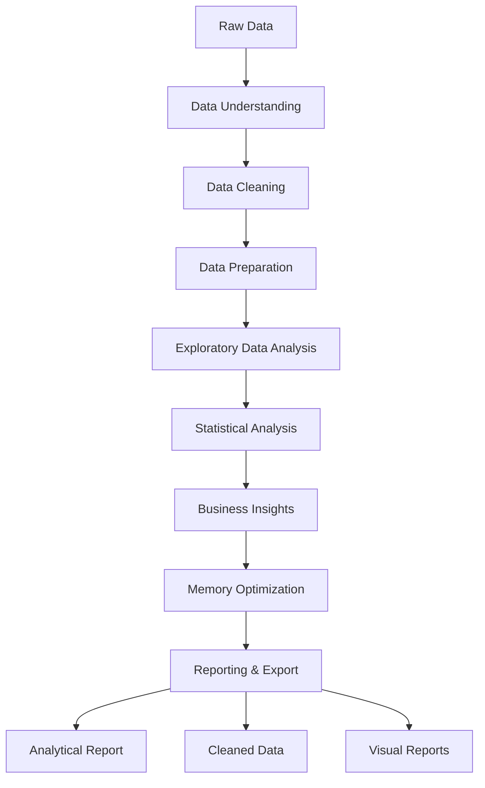
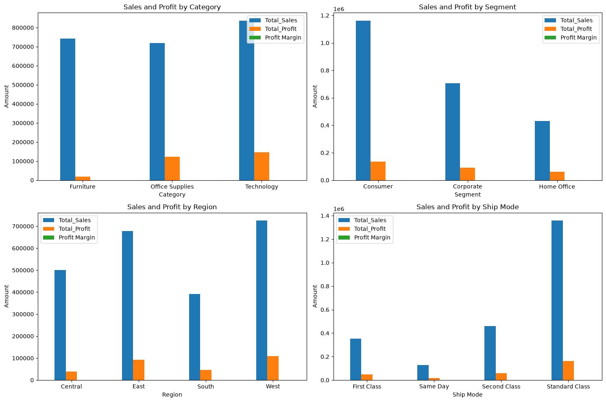
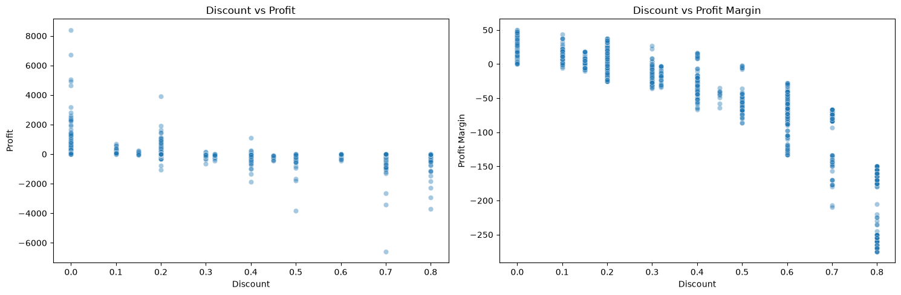
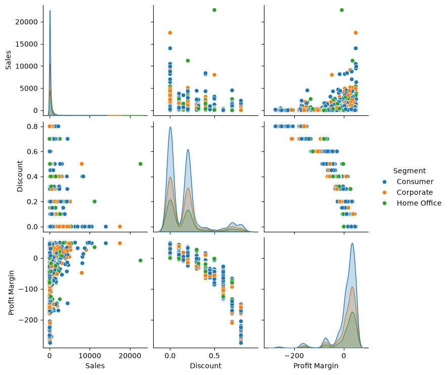
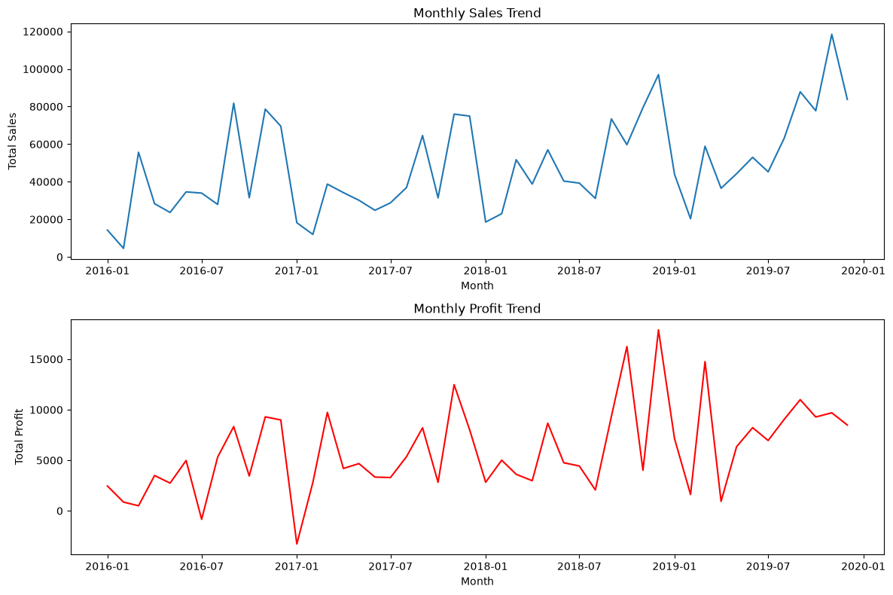
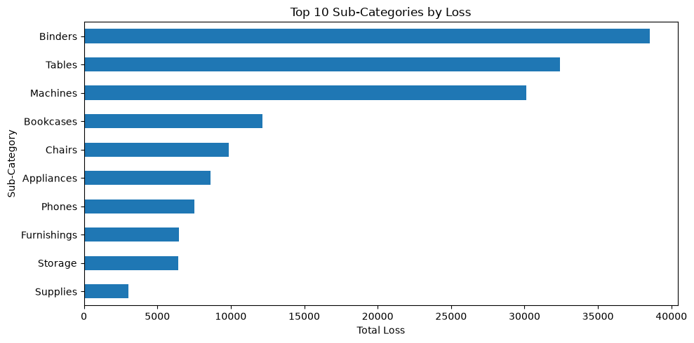
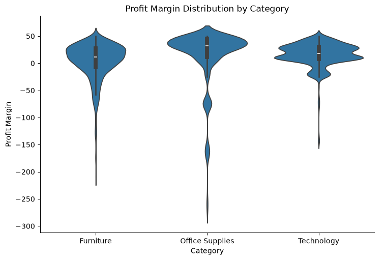
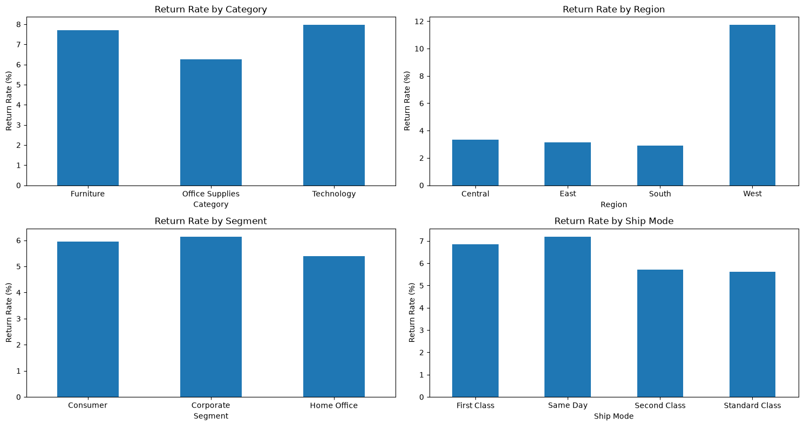
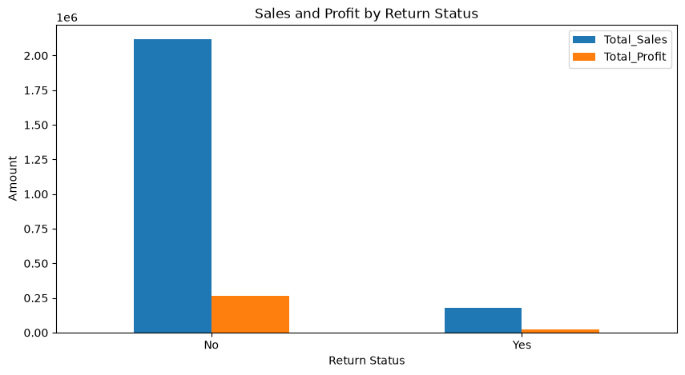

# Superstore 2019 Analysis

This project analyzes the Sample Superstore 2019 dataset with Python to understand sales, profitability, customers, products, shipping, and returns.

The notebook follows the analysis from raw data inspection through cleaning, feature engineering, exploratory analysis, diagnostic analysis, recommendations, performance optimization, and final reporting.

## Business Questions

The analysis is built around six main business questions:

1. Which categories, regions, segments, and customers generate the most sales?
2. Which products and sub-categories contribute most to profit?
3. At what discount levels does profitability start to suffer?
4. Which areas have the highest concentration of loss-making transactions?
5. How different are returned and non-returned orders?
6. Does shipping duration appear to be related to profitability?

## Analytical Workflow

The analysis follows a structured process from raw data to final business insights and project outputs.

### 1. Data Loading and Initial Inspection

The `Orders`, `People`, and `Returns` sheets are imported from the source Excel workbook. The notebook reviews the dataset structure, columns, data types, and sample records before any transformation.

### 2. Data Quality Assessment

The raw data is checked for missing values, duplicate records, data type issues, and formatting problems. The three source sheets are reviewed separately before they are integrated for the returns analysis.

### 3. Data Cleaning and Feature Engineering

The data is cleaned by handling missing postal codes, duplicate records, whitespace issues, and data type corrections. Reusable classes and functions are used for cleaning and feature engineering.

The analysis creates derived fields including `Shipping Duration`, `Profit Margin`, `Profit per Unit`, `Sales per Unit`, `Sales Performance Category`, and date components used during the analysis.

### 4. Exploratory Data Analysis

The EDA examines sales, profit, profit margin, customers, products, categories, segments, regions, shipping modes, discounts, returns, and time trends.

The visual analysis includes distribution plots, boxplots, violin plots, categorical comparisons, time series, loss-driver analysis, return analysis, and correlation analysis.

### 5. Diagnostic Analysis

The diagnostic stage goes beyond describing the data and investigates the main drivers of profitability. It focuses on discount levels, loss-making transactions, loss drivers by sub-category, product profitability, shipping performance, people performance, and return patterns.

### 6. Prescriptive Analysis

The main findings are translated into practical recommendations. The focus is on controlling aggressive discounts, prioritizing stronger product and sub-category performance, reviewing loss drivers, and investigating areas with relatively high return rates.

### 7. Performance Optimization

After the analysis is complete, the export version of the `Orders` dataset is optimized. Unnecessary date components and the original row identifier are removed, categorical fields are converted to `category`, and suitable numeric fields are reduced to smaller numeric types.

In the recorded run, memory usage for `Orders` decreased from 9.3 MB to 1.2 MB, a reduction of 87.1%.

### 8. Reporting and Export

The final stage produces a KPI summary and an analytical report from the results generated throughout the notebook. The cleaned `Orders`, `People`, and `Returns` datasets are exported together in one Excel workbook.

The main analysis figures are also saved as PNG files for use outside the notebook.

## Key Results

| KPI                   |       Result |
| --------------------- | -----------: |
| Total Sales           | 2,297,200.86 |
| Total Profit          |   286,397.02 |
| Overall Profit Margin |       12.47% |
| Unique Orders         |        5,009 |
| Unique Customers      |          793 |
| Unique Products       |        1,862 |
| Return Rate           |        5.91% |

The analysis found that Technology leads sales among categories, Consumer leads among customer segments, and West leads among regions. Discount and Profit Margin have a strong negative correlation of -0.864, while Quantity and Sales have a weak positive correlation of 0.201.

The analysis also highlights Binders as the largest loss driver and Labels as the sub-category with the highest Profit Margin. Shipping duration shows limited impact on profitability, while Technology has the highest return rate among categories.

## Selected Visualizations

The repository includes the main figures generated during the analysis.

### Sales and Profit by Key Dimensions

### Discount and Profitability Analysis

### Correlation Matrix

### Monthly Sales and Profit Trends

### Loss Drivers by Sub-Category

### Profit Margin Distribution

### Returns by Key Dimensions

### Sales and Profit by Return Status

## Tools

- Python
- Pandas
- NumPy
- Matplotlib
- Seaborn
- Jupyter Notebook
